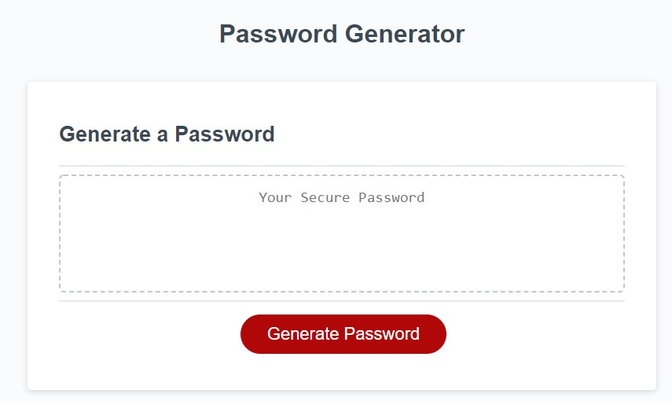

# js-passwordgenerator
Homework03 - Makoto Asahi
## Summary
Generates a random password between 8 and 128 characters.

User can select 4 criteria for their password:
>uppercase, lowercase, numbers, and special characters
> Double Quotes and Backslash were omitted from special characters.

Restarts if the password length is not between 8 and 128.

Restarts if password length is not a number.

Restarts if no password criteria is selected.

New password will replace text if the button is clicked again.

It is possible for the generated password to not have a selected criteria due to pure randomness.

Kept pre-written code as best as possible.



### Requirements

Create an application that generates a random password based on user-selected criteria. This app will run in the browser and feature dynamically updated HTML and CSS powered by your JavaScript code. It will also feature a clean and polished user interface and be responsive, ensuring that it adapts to multiple screen sizes.

```
GIVEN I need a new, secure password
WHEN I click the button to generate a password
THEN I am presented with a series of prompts for password criteria
WHEN prompted for password criteria
THEN I select which criteria to include in the password
WHEN prompted for the length of the password
THEN I choose a length of at least 8 characters and no more than 128 characters
WHEN prompted for character types to include in the password
THEN I choose lowercase, uppercase, numeric, and/or special characters
WHEN I answer each prompt
THEN my input should be validated and at least one character type should be selected
WHEN all prompts are answered
THEN a password is generated that matches the selected criteria
WHEN the password is generated
THEN the password is either displayed in an alert or written to the page
```